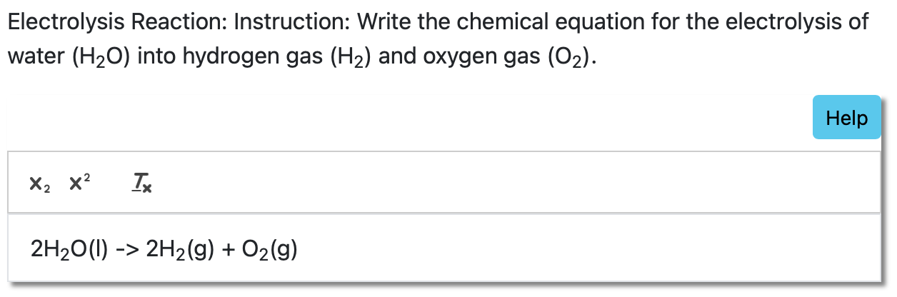

# PrairieLearn OER Element: Chemistry Input

This element was developed by Ananya Barman, Jayshri Ganguli and Shengyuan Wang. Please carefully test the element and understand its features and limitations before deploying it in a course. It is provided as-is and not officially maintained by PrairieLearn, so we can only provide limited support for any issues you encounter!

If you like this element, you can use it in your own PrairieLearn course by copying the contents of the `elements` folder into your own course repository. After syncing, the element can be used as illustrated by the example question that is also contained in this repository.


## `pl-chem-input` element

This element is intended for questions that require chemical equations as an answer. It is based on the Quill editor that is used in `pl-rich-text`, but it is simplified to only support superscripts and subscripts. It also supports auto-grading answers with some built-in flexibility for re-ordering elements within one part of the equation. States of matter are optional by default, but can be graded as well.

### Example



```html
<pl-chem-input question-name="water" show-help-text="false" prefill="H_2O -> H_2 + O_2"></pl-chem-input>
```

#### Customizations

| Attribute            | Type                          | Default            | description                                                                                                                                                                                                                                                                                                                                                                                                                                           |
| -------------------- | ----------------------------- | ------------------ | ----------------------------------------------------------------------------------------------------------------------------------------------------------------------------------------------------------------------------------------------------------------------------------------------------------------------------------------------------------------------------------------------------------------------------------------------------- |
| `question-name`          | string (required)                       | None                  | A unique identifier for the question element.   |
| `weight` | integer | 1 | Weight to use when computing a weighted average score over elements. |
|`grade-states` | boolean | false |  If set to `true`, states of matter are considered for grading (and answers without them are treated as incorrect). If set to `false`, states of matter are optional. |                                                                                                                            |
| `placeholder`        | string                     | "Your answer here" | Text to be shown in the editor as a placeholder when there is no student input.  |
| `prefill`           | string | -   | Initial answer to be prefilled when the question is first displayed.                        |
| `source-file-name`   | string                        | None               | Initial answer to be prefilled when the question is first displayed, loaded from a source file with existing content. The `directory` attribute can be used to locate the file. This attribute cannot be used in combination with `prefill`. |
| `directory` | string | None | Specifies the directory where the `source-file-name` file is located. Use `clientFilesCourse` or `serverFilesCourse` to reference course-level directories, or provide a relative path within the question's directory. If omitted, the file is searched in the question's main directory. |
| `quill-theme`        | string                        | `snow`             | Specifies the theme for the Quill editor; See [the Quill documentation](https://quilljs.com/docs/themes/) for more information about additional themes.           
| `allow-blank`        | boolean                       | false              | If set to `true`, empty inputs are allowed. By default, empty submissions will not be graded (invalid format).       |
| `show-help-text`    | boolean | true  | If set to `true`, a help text tooltip is displayed next to the input field.                           |
| `size`              | integer | 100   | The element width relative to parent container (in percent).|         
|`show-score` | boolean | true |  If set to `true`, a score badge is displayed next to this element after grading. |
|`include-feedback` | boolean | true |  If set to `true`, students receive feedback when they submit an incorrect answer. The feedback tells students what part of the submission (e.g., reactants, products, states of matter) is incorrect. |


### Keyboard Shortcuts for the Editor

The following keyboard shortcuts can enhance the editing experience for students:

- **Toggle Superscript (`Option` + `↑`)**  
  Press the **Option** key (or **Alt** on Windows) with the **Up Arrow** to toggle superscript formatting.

- **Toggle Subscript (`Option` + `↓`)**  
  Press the **Option** key (or **Alt** on Windows) with the **Down Arrow** to toggle subscript formatting.

- **Clear Formatting (`Option` + `\`)**  
  Press the **Option** key (or **Alt** on Windows) with the **Backslash** key to:  
  - Remove the current script format when no text is selected.  
  - Clear formatting for the selected text range.
