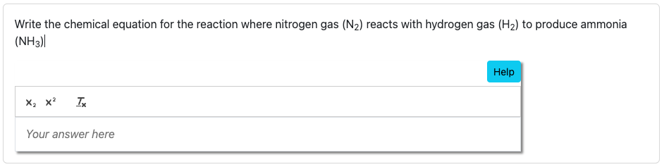

## `pl-chem-input` element

### Example



```html
<pl-chem-input question-name="water" show-help-text="T" prefill="H_{2}O size="80"></pl-chem-input>
```

#### Customizations

| Attribute            | Type                          | Default            | description                                                                                                                                                                                                                                                                                                                                                                                                                                           |
| -------------------- | ----------------------------- | ------------------ | ----------------------------------------------------------------------------------------------------------------------------------------------------------------------------------------------------------------------------------------------------------------------------------------------------------------------------------------------------------------------------------------------------------------------------------------------------- |
| `question-name`          | string                        | None                  | A unique identifier for the question. This attribute must be provided.                                                                                                                                                                                                                                                                                                                                  |
| `weight` |integer |1 | Weight to use when computing a weighted average score over elements. |
| `quill-theme`        | string                        | `snow`             | Specifies a Quill editor theme; the most common themes are `snow` (which uses a default toolbar) or `bubble` (which hides the default toolbar, showing formatting options when text is selected). See [the Quill documentation](https://quilljs.com/docs/themes/) for more information about additional themes.                                                                                                                                       |
| `source-file-name`   | string                        | None               | Name of the source file with existing content to be displayed in the editor. Requires the file name (`source-file-name`) and optionally the `directory` attribute to locate the file. The format of this file must match the format specified in the `format` attribute. |
| `directory` | string | None | Specifies the directory where the `source-file-name` file is located. Use `clientFilesCourse` or `serverFilesCourse` to reference course-level directories, or provide a relative path within the question's directory. If omitted, the file is searched in the question's main directory. |
| `placeholder`        | string                        | "Your answer here" | Text to be shown in the editor as a placeholder when there is no student input.  |
| `allow-blank`        | boolean                       | false              | Whether or not an empty input box is allowed. By default, empty submissions will not be graded (invalid format).       |
| `show-help-text`    | boolean | true   | Displays a help text tooltip for the input field.                           |
| `prefill`           | string | -   | Directly sets the editor's initial content as a string.  Does not require an external file or directory.                         |
| `size`              | integer | 100   | Determines the ratio to parent container(0 - 100).|         
|`show-score` | boolean | true |  Whether to show the score badge and feedback next to this element. |
|`grade-states` | boolean | false |  Whether to grade the states of matter or not. |
|`include-feedback` | boolean | true |  Whether to display feedback to help student fix their submitted answer. |

### Custom Keyboard Shortcuts for Editor

The following keyboard shortcuts enhance the editing experience by providing custom behaviors:

- **Toggle Superscript (`Option` + `↑`)**  
  Press the **Option** key (or **Alt** on Windows) with the **Up Arrow** to toggle superscript formatting.

- **Toggle Subscript (`Option` + `↓`)**  
  Press the **Option** key (or **Alt** on Windows) with the **Down Arrow** to toggle subscript formatting.

- **Clear Formatting (`Option` + `\`)**  
  Press the **Option** key (or **Alt** on Windows) with the **Backslash** key to:  
  - Remove the current script format when no text is selected.  
  - Clear formatting for the selected text range.
